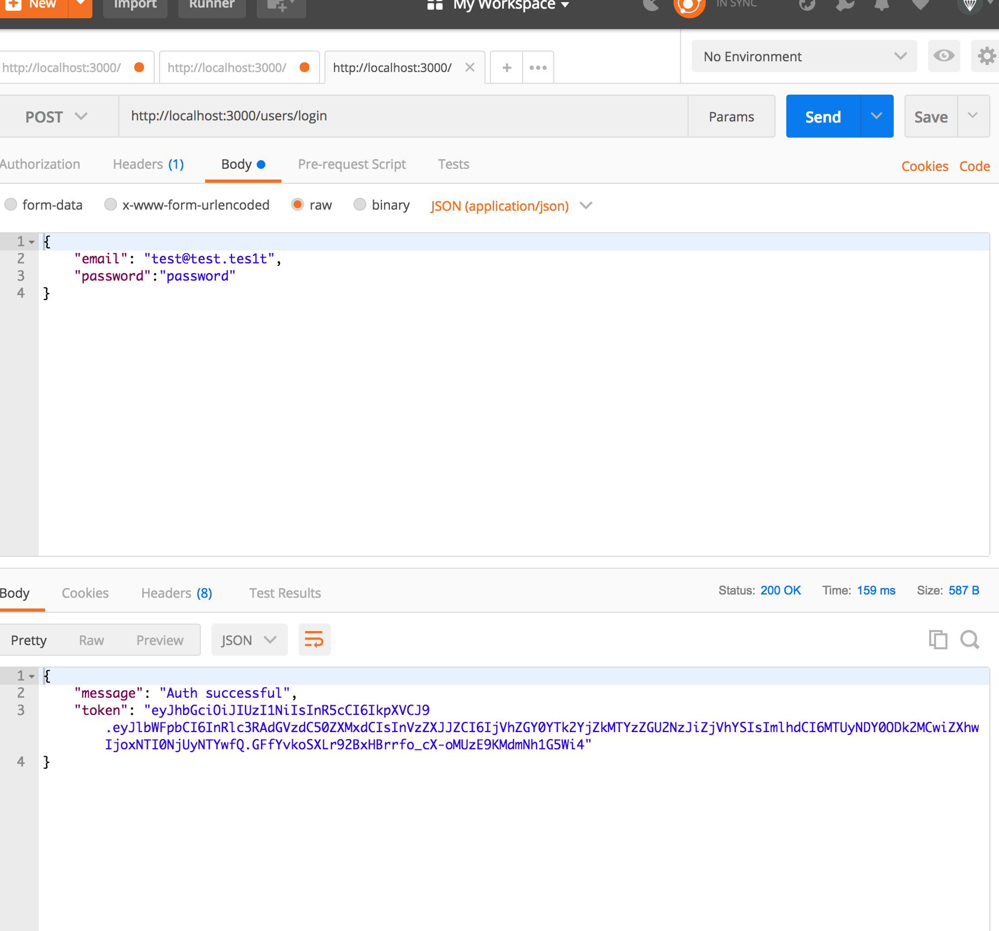

# hands-on-express-api

This project is pure API. No front-end created. 

1) `git clone git@github.com:sweettirexkiller/hands-on-express-api.git`
2) `cd hands-on-express-api`
3) `npm install`
4) `nano app.js`

        ...
        mongoose.connect('mongodb://localhost/YOUR_DB_HERE');
        ...
        
    `ctrl+O ctrl+X`
 
5) `npm start` -> [localhost:3000](http://localhost:3000)
6) use postman for these routes: 

        /users/signup (post)
        /users/login  (post)
        /users/:userId (del)
        /products (get, post)
        /products/:id (get, patch, del)
        /orders (get, post)
        /orders/:id (get, patch, del)
        
 > INFO: Almost all of the routes require Authentication Header with JWT valid for 1h after login. 
        
        